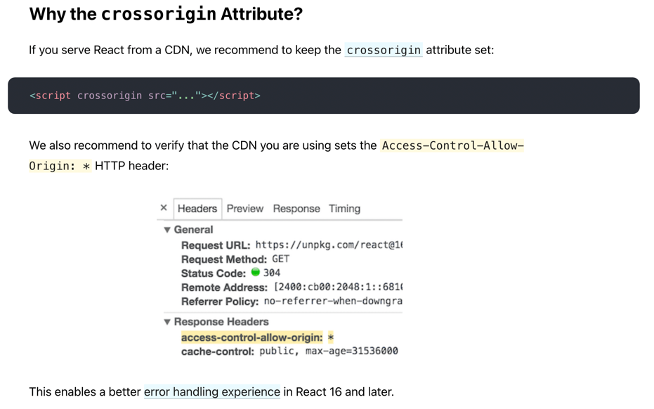

## Chapter 01 - Inception

## Theory -

### 1. What is Emmet?

> Emmet is a set of plug-ins for text editors that allow for high-speed coding and editing in HTML, XML, XSLT, and other
> structured code formats via content assist.

### 2. Difference between a Library and Framework?

> JS frameworks and JS libraries are both pieces of code authored by others to solve everyday problems. They are,
> nonetheless, distinct.  
> JS libraries give developers predefined methods and classes to help them work faster and more efficiently. On the
> other hand, the JS framework acts as a framework for developers to construct apps for specific platforms.  
> The term "inversion of control" describes the technical distinction between a framework and a library. You have
> complete control over the application's flow when you use a library. You get to decide when and where you want to call
> the library. While when using a framework, the flow is controlled by the framework itself. It gives you various
> locations to plug in your code, but it only calls the code you've plugged in when it's needed.

Reference: https://www.microverse.org/blog/javascript-library-vs-javascript-frameworks-the-differences

### 3. What is CDN? Why do we use it?

> A content delivery network (CDN) refers to a geographically distributed group of servers which work together to
> provide fast delivery of Internet content.  
> A CDN allows for the quick transfer of assets needed for loading Internet content including HTML pages, javascript
> files, stylesheets, images, and videos. The popularity of CDN services continues to grow, and today the majority of
> web traffic is served through CDNs, including traffic from major sites like Facebook, Netflix, and Amazon.

Reference links: 
[What is a CDN? How do CDNs work?](https://www.cloudflare.com/en-in/learning/cdn/what-is-a-cdn/) 
[What Is A CDN? How Does It Work?](https://youtu.be/RI9np1LWzqw) 
[Using CDNs for JavaScript Library Hosting](https://youtu.be/CD68mF9WCGQ)

### 4. Why is React known as React?

> React is named React because of its ability to react to changes in data. When the data in a React component changes,
> React will automatically re-render the component so that it reflects the new data. This makes it easy to create
> performant user interfaces that always look up-to-date.  
> React is called React because it was designed to be a declarative, efficient, and flexible JavaScript library for
> building user interfaces.
> The name "React" was chosen because the library was designed to allow developers to "react" to changes in state and
> data \within an application, and to update the user interface in a declarative and efficient manner.  
> React was developed for applications (Facebook) that have constantly changing data. Since React is a front-end
> framework or the “View” in MVC, this means that as the user clicks around and changes the app’s data, the view should
> “react” or change with those user events. User events being mouse clicks, typing, submitting a form

### 5. What is crossorigin in script tag?

#### General Headers (made by Browser)

> __Referrer Policy__: strict-origin-when-cross-origin  
> __Request Method__: OPTIONS (preflight request) 

#### Request Headers

> Access-Control-Request-__Method__: POST (client requesting POST method execution)  
> Access-Control-Request-__Headers__: Content-Type  

#### Response Headers

> Access-Control-Allow-__Origin__: *   (server allows every origin)  
> Access-Control-Allow-__Origin__: http://localhost:4200 (server allows requests only from http://localhost:4200)  
> Access-Control-Allow-__Methods__: GET, PUT (server allows only GET & PUT request methods, doesn't allow POST &
> DELETE)  
> Access-Control-Allow-__Headers__: Content-Type  

Reference links:  
https://reactjs.org/docs/cdn-links.html  
[CORS, Preflight Request, OPTIONS Method | Access Control Allow Origin Error Explained](https://youtu.be/PNtFSVU-YTI) 
[CORS, Preflight Request, OPTIONS Method | Access Control Allow Origin Error Explained](https://www.youtube.com/watch?v=tcLW5d0KAYE&ab_channel=AkshaySaini)

### 6. What is difference between React and ReactDOM?

> React and ReactDOM were only recently split into two different libraries. Prior to v0.14, all ReactDOM functionality
> was part of React. This may be a source of confusion, since any slightly dated documentation won't mention the React /
> ReactDOM distinction.  
> As the name implies, ReactDOM is the glue between React and the DOM. Often, you will only use it for one single thing:
> mounting with ReactDOM.render(). Another useful feature of ReactDOM is ReactDOM.findDOMNode() which you can use to
> gain
> direct access to a DOM element. (Something you should use sparingly in React apps, but it can be necessary.) If your
> app
> is "isomorphic", you would also use ReactDOM.renderToString() in your back-end code.  
> For everything else, there's React. You use React to define and create your elements, for lifecycle hooks, etc. i.e.
> the guts of a React application.  
> The reason React and ReactDOM were split into two libraries was due to the arrival of React Native. React contains
> functionality utilised in web and mobile apps. ReactDOM functionality is utilised only in web apps.  
> __React package contains:__ React.createElement, React.createClass, React.Component, React.PropTypes,
> React.Children  
> __React-dom package contains:__ ReactDOM.render, ReactDOM.unmountComponentAtNode, ReactDOM.findDOMNode  
> __react-dom/server that's including:__ ReactDOMServer.renderToString and ReactDOMServer.renderToStaticMarkup.

Reference links: [React vs ReactDOM](https://stackoverflow.com/questions/34114350/react-vs-reactdom)

### 7. What is difference between react.development.js and react.production.js files via CDN?

> If you’re benchmarking or experiencing performance problems in your React apps, make sure you’re testing with the
> minified production build.   
> By default, React includes many helpful warnings. These warnings are very useful in development. However, they make
> React larger and slower so you should make sure to use the production version when you deploy the app.

Reference links: [Use the Production Build](https://reactjs.org/docs/optimizing-performance.html)

### 8. What is async and defer?

> Your HTML will display quicker in older browsers if you keep the scripts at the end of the body right before </body>.
> So, to preserve the load speed in older browsers, you don't want to put them anywhere else.
  
> If your second script depends upon the first script (e.g. your second script uses the jQuery loaded in the first
> script), then you can't make them __async__ without additional code to control execution order, but you can make them
> defer
> because defer scripts will still be executed in order, just not until after the document has been parsed. If you have
> that code and you don't need the scripts to run right away, you can make them async or defer.
  
> You could put the scripts in the <head> tag and set them to __defer__ and the loading of the scripts will be deferred
> until the DOM has been parsed and that will get fast page display in new browsers that support defer, but it won't
> help
> you at all in older browsers and it isn't really any faster than just putting the scripts right before </body> which
> works in all browsers. So, you can see why it's just best to put them right before </body>.
  
> __Async__ is more useful when you really don't care when the script loads and nothing else that is user dependent
> depends
> upon that script loading. The most often cited example for using async is an analytics script like __Google Analytics
__
> that
> you don't want anything to wait for and it's not urgent to run soon and it stands alone so nothing else depends upon
> it.
  
> Usually the __jQuery library__ is ___not___ a good candidate for __async__ because other scripts depend upon it and
> you want to
> install event handlers so your page can start responding to user events and you may need to run some jQuery-based
> initialization code to establish the initial state of the page. It can be used async, but other scripts will have to
> be
> coded to not execute until jQuery is loaded.

Reference links:  
[async vs defer attributes in Javascript](https://youtu.be/IrHmpdORLu8)  
[stack_overflow: script-tag-async-defer](https://stackoverflow.com/questions/10808109/script-tag-async-defer)

## Coding

1. Set up all the tools in your laptop ○ VS Code
2. Chrome
3. Extensions of Chrome
4. Create a new Git repo
5. Build your first Hello World program using, ○ Using just HTML
6. Using JS to manipulate the DOM ○ Using React
7. use CDN Links
8. Create an Element
9. Create nested React Elements
10. Use root.render
11. Push code to Github (Theory as well as code)
12. Learn about Arrow Functions before the next class

## References:

- https://beta.reactjs.org/apis/react/createElement
- https://www.youtube.com/watch?v=IrHmpdORLu8
