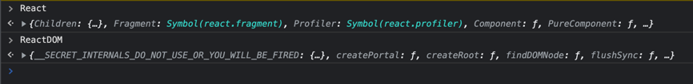
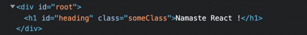
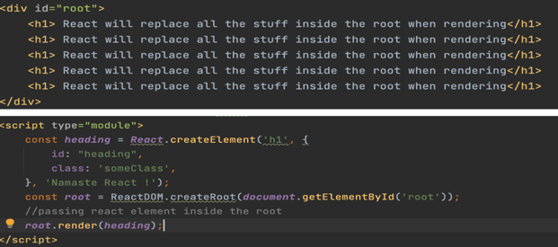
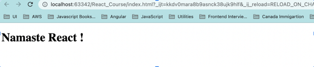
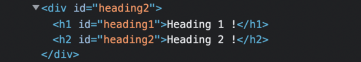

## Injecting _react_ library via CDN:

```javascript
<script crossorigin src="https://unpkg.com/react@18/umd/react.development.js"></script>
<script crossorigin src="https://unpkg.com/react-dom@18/umd/react-dom.development.js"></script>
```

Browser console:



## Using _props_ on createElement():

```javascript
const heading = React.createElement(
    "h1",
    {
        id: "heading",
        class: "someClass",
    },
    "Namaste React !"
);
```



## _render()_ method behavior:



Output:



## Append multiple children:

```javascript
const div = React.createElement(
    "div",
    {
        id: "heading2",
    },
    [heading1, heading2]
);
```

Output:



<br/>
<br/>
<br/>
<br/>


